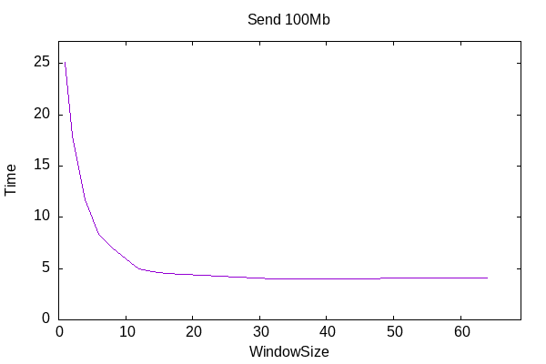
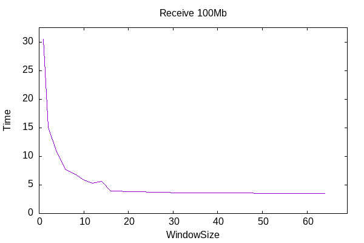
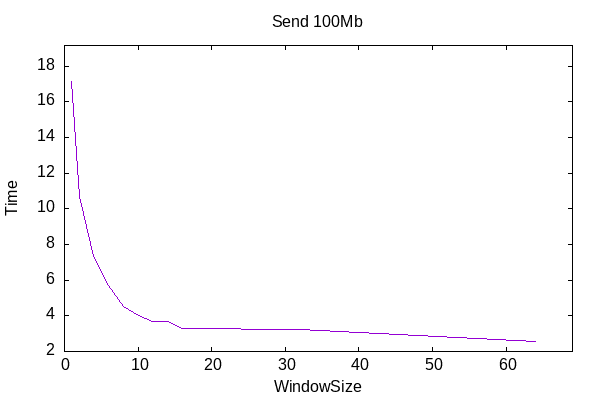
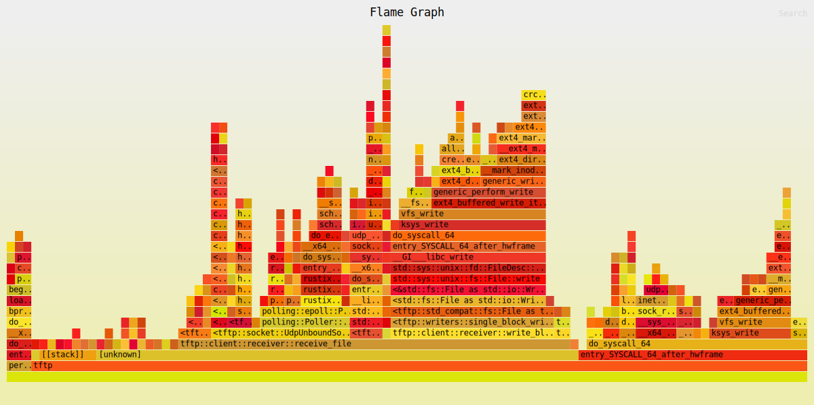
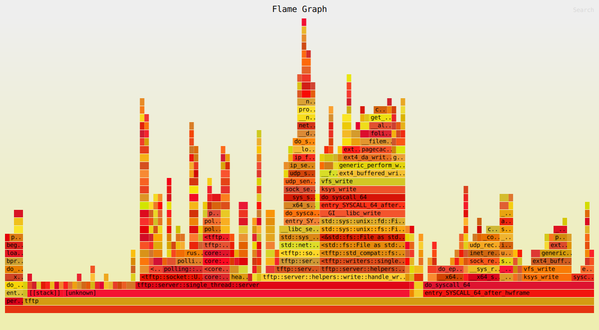

### Transfer times

Encryption

No encryption

### Packets dumps

[Send data](./send_capture_no_encryption_stack.pcap)

[Receive data](./receive_capture_no_encryption_stack.pcap)

[Optional encryption send](./send_capture_delayed_encryption.pcap)

[Optional encryption receive](./receive_capture_delayed_encryption.pcap)

[Full encryption send and receive](./full_encryption_capture.pcap)

### Flamegraphs

Alloc encryption

Stack no encryption

